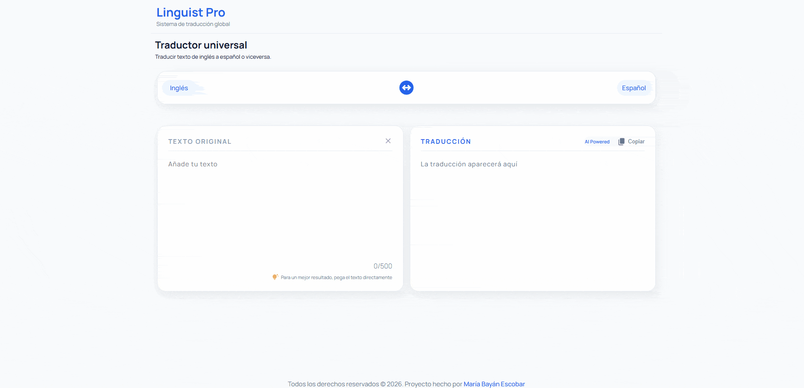

# 🌐 Linguist Pro - AI Translator

English to Spanish translation web application powered by artificial intelligence, using the Llama 3 model via the Groq API.

## 🛠️ Technologies

## 🚀 Features

- Easy-to-use translator similar to Google Translate.
- Minimalist interface.
- Bidirectional translation with one-click language swap.
- Translator with integrated AI Groq API.

## 📚 What I learned

- How to integrate a third-party AI API (Groq) using `fetch` and `async/await`.
- How to protect API credentials using a **Vercel Serverless Function**,
  keeping the key server-side and never exposed in the browser.
- How to implement a **debounce** pattern to optimize API usage.
- How to deploy a frontend project with environment variables on Vercel.

## 🔮 Future Improvements

- Support for more languages.
- Dark mode UI.
- Automatic source language detection.
- Translation history.

## 🖥️ Local Setup

### Option 1 – Deploy (recommended)
1. Fork the repository.
2. Import it into [vercel.com](https://vercel.com)
3. Add your `GROQ_API_KEY` as an environment variable.
4. Deploy,

### Option 2 – Run locally
1. Clone the repository.
2. Get a free API key at [console.groq.com](https://console.groq.com/keys)
3. In `main.js`, replace the `/api/translate` fetch with a 
   direct call to the Groq API and paste your key in the 
   Authorization header.
4. Open `index.html` with Live Server.

> ⚠️ Never commit your API key to a public repository

## 🔗 Live Demo

👉 [Linguist Pro](https://linguist-pro-kohl.vercel.app/)

## 📸 Preview

